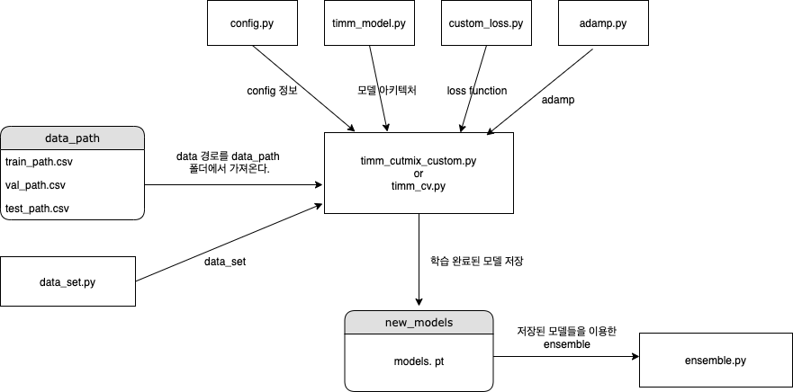

# Stage1 Image Classification

​           

## 목표/ 결과

- 나이( ~29, 30~59, 60~ ), 마스크 착용여부(착용, 오착용, 미착용), 성별 (남/여) 에따른 18개의 class로 분류

- F1 score 기준 리더보드

- 최종 F1 score : 0.7568,     public rank : 5,     private rank : 22

  ​           

## 구성

​         

​          

## 아이디어(최종 사용)

- data

  노년층과 중년층의 경계 나이 변경

  기존의 경계선 이였던. 60세를 더 낮은 나이인 50대 후반으로 변경하여도 노인의 특징을 가지

  고 있을 것이라고 판단하였고 더 낮은 나이로 변경함으로 노년층의 data가 상대적으로 적었

  던 문제를 해결 할 수 있었다.

​                  

- custom_loss.py

  일반적인 crossentropy loss에  1 - f1 score를 더해준 loss로 f1score를 최대로 하도록 학습유도

  ​           

- timm_cutmix_custom.py

  일반적인 cutmix는 얼굴 혹은 마스크부분이 잘려지지 않을 수 도 있기에 절반을 세로로 잘라 cutmix

  전반적으로 중년층과 노년층의 데이터를 구분을 못하기에 노년층의 데이터만 cutmix로 사용

  ​        

- timm_cv.py

  k fold cross validation 사용

  ​        

- Age ensemble

  Age의 경계를 구별하는 것이 가장 큰 문제라고 생각했고 이를 해결하기 위하여 여러가지 관

  점을 가진 모델을 앙상블 하면 좋을 것 이라고 생각하였다. 이 방법으로 경계 나이를 55 ~ 60

  로 하는 data set으로 각각의 모델을 학습시켜 경계가 되는 나이를 가진 사람에 대하여 다른

  관점을 가지는 모델들을 ensemble 시켜 좋은 성과를 보였다.

​            

- Age weight

  위에서 좋은 성과를 보였던 경계 나이를 변경하는 방법과 경계 age별 앙상블 이였지만 이는

  원래 경계인 60세보다 더 낮은 나이를 경계로 학습하는 방법이라고 생각하여 최종 softmax를

  통과한 확률값 중 중년층에 해당하는 label에 추가적으로 값을 더해주는 방식으로 해결하고자

  하였고 퍼블릭 리더보드에서는 좋은 성과를 보였다.